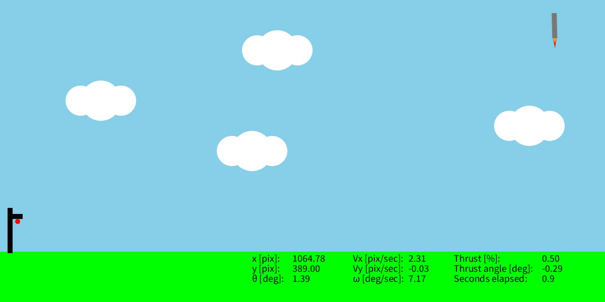

# StaRS 2D - an educational 2D Starship Re-entry Simulator



**StaRS 2D** is a very simple simulator to that puts you in charge of the
re-entry of **Starship** back to Earth.

You will guide Starship safely to the launch tower
experimenting with **thrust vectoring** - the way rockets steer in space -
to design your own **flight controller**.

Whether you're a student interested in rocketry or a teacher looking for a 
fun and game-like way to teach control engineering concepts, this simulator may
be what you're looking for!

## Why?

As a control engineer, many times I have been asked (by friends, family, ...) to
explain what control engineering is.
Most of the times I would only get confused faces so I started answering with
a simple: "Well, it's robotics".
Then I started working in the aerospace field and people started wondering:
"But... didn't you study robotics??"... Darn it! :)

I don't really expect my friends/family to learn what control engineering is by
using this simulator.
However, I do believe future generations should be quite aware of this
field as it is becoming more and more important in modern
engineering.
This simulator could be a simple way to introduce young people to the
field by showing a cool (but very simplified) control
application.

## Pre-requisites

In order to succeed with the descent and the landing of Starship, it is
recommended that:
1.  You have a basic understanding of physics (gravity acceleration, forces and
torques), trigonometry (sine and cosine functions) and geometry (coordinate
systems and scalar projection);
1.  You have a very basic knowledge of programming (define variables, calling
a function and basic programming structures).
1.  You have basics of control engineering (at least PID controllers).

At the moment a course to explain basic control engineering techniques using
this simulator is in the making.
The course will be written in order to have less pre-requisites.

## Installation

To begin with, we need to install Processing to run StaRS 2D.
You can follow the instructions of this [link](https://processing.org/download)
to download the latest Processing software version.
However, the code was written with an older version (4.3) that can be downloaded
[here](https://github.com/processing/processing4/releases/tag/processing-1293-4.3).

To install StaRS 2D, just clone this
github repository and open
<em>stars2d.pde</em> with Processing (File -> Open... and select such a
file wherever you cloned the repository).

## Tools to design your controller

As soon as you open StaRS 2D on Processing, you will get something like this:

<p align="center">
  
</p>

You should only modify the code in <em>stars2d.pde</em>.
You can define useful
variables at the beginning of the file and/or add thrust vectoring control
inputs in the "Controller design" area (see the red annotations in the previous
image).

The position and the attitude of Starship is expressed with respect to a
coordinate system that has its origin in the "landing point" of the launch 
tower.
Starship's position is indicated with a pair $(x,y)$ of decimal values.
The velocity along the axes $x$ and $y$ is denoted with $Vx$ and $Vy$.
The attitude is represented by the angle $\theta$ and the associated angular
velocity is $\omega$.
A graphical description of such quantities is shown in the following figure.

<p align="center">
  
</p>

To give thrust vectoring inputs, the simulator provides the following functions:

| Function | Description |
| :---------------- | :-------------------- |
| cmd.setThrustCommand(val) | Determines the thrust. 'val' must be between 0 and 1: negative values will be forced to 0, whereas values greater than 1 will be forced to 1. When the angle $\theta$ of Starship equals 0, a thrust command of 0.5 perfectly compensates gravity.|
| cmd.setThrustAngleCommand(val) | Determines the angle of thrust. It is limited to [-30,30] degrees, thus values outside this interval will be forced to either -30 (if val<-30) or 30 degrees (if val>30)|

<p align="center">
  
  
</p>

In order to design feedback controllers (i.e. giving thrust vectoring
inputs based on the current attitude/position/velocity), the simulator provides
functions to access the on-board sensors of Starship:

| Function | Description |
| :---------------- | :-------------------- |
| env.getStarshipXPosition() | Returns x-coordinate of Starship's position|
| env.getStarshipYPosition() | Returns y-coordinate of Starship's position |
| env.getStarshipVx() | Returns x-coordinate of Starship's velocity |
| env.getStarshipVy() | Returns y-coordinate of Starship's velocity |
| env.getStarshipAngle() | Returns $\theta$ angle value |
| env.getStarshipOmega() | Returns angular velocity $\omega$ value |

The simulator also provides additional functions:
-   <em>env.getElapsedTime()</em>: to get the elapsed time from the beginning of
the simulation.
-   <em>env.getDestinationX()</em> and <em>env.getDestinationY()</em> to get
the coordinates of the landing point.
These simply returns 0 as the landing point is considered to be the "zero" point
of the coordinate system.
-   <em>env.getStarshipMass()</em> and <em>env.getStarshipInertia()</em> to get
the mass and the inertia of Starship, respectively.

## How to successfully land

You fail the re-entry mission if:
1.  You crash to the ground;
2.  You hit the launch tower;
3.  You land too quickly (velocity must be between -0.1 and 0.1 [pixel/seconds]
the moment you reach the landing point).

You succeed the descent and the landing if:
1.  You reach any point in the square defined by $x$ in $[-1,1]$ and $y$ in the
same interval while having $\theta$ in $[-0.5,0.5]$ degrees and both $Vx$ and
$Vy$ in $[-0.1,0.1]$.

## Dynamics implementation

The Starship's dynamics are implemented in a very simple way.
It is assumed that the center of mass and the center of gravity coincide.
Therefore, letting <em>T</em> be the thrust command, the forces equations are
implemented as:

```math
F_x=T\sin(\theta),\ F_y=T\cos(\theta)-g
```

Letting <em>L</em> be the length of the ("longer" side of the) Starship,
the torque equation is implemented as:

```math
\tau=T\frac{L}{2}\sin(\theta)
```

The accelerations can be computed by multiplying the forces
by the inverse of the Starship's mass $m=1$ and the
torque by the inverse of the inertia $I=1000$ (NOTE: the mass and the inertia
have been chosen in order to have decent controllability of Starship).
Then, simple integration of these acceleration equations with a sampling time of
$T_s=0.1s$ produces the motion dynamics of the Starship.
