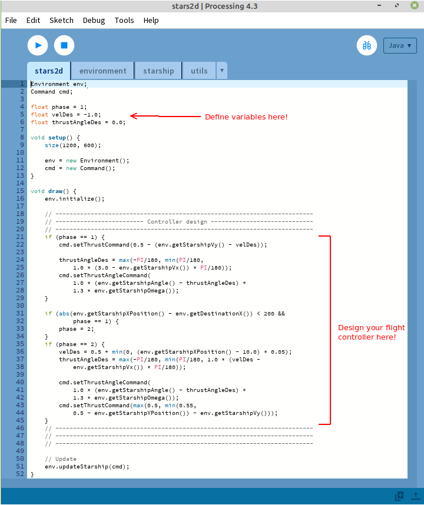

# StaRS 2D - an educational 2D Starship Re-entry Simulator


**StaRS 2D** is a very simple simulator to that puts you in charge of the
re-entry of **Starship** back to Earth.

You will guide Starship safely to the ground tower
experimenting with **thrust vectoring** - the way rockets steer in space -
to design your own **flight controller**.

Whether you're a student interested in rocketry or a teacher looking for a 
fun and game-like way to teach control engineering concepts, this simulator may
be what you're looking for!

## Why?

As a control engineer, many times I have been asked (by friends, family, ...) to
explain what control engineering is.
Most of the times I would only get confused faces so I started answering with
a simple: "Well, it's robotics".
Then I started working in the aerospace field and people started wondering:
"But... didn't you study robotics??"... Darn it!

I don't really expect my friends/family to learn what control engineering is by
using this simulator.
However, I do believe future generations should be quite aware of this
field as it is becoming more and more important in modern
engineering applications.
This simulator could be a simple way to introduce young people to the
field by providing a simple but cool control engineering application.

## Pre-requisites

In order to succeed with the descent and the landing of Starship, it is
recommended that:
1.  You have a basic understanding of physics (gravity acceleration, forces and
torques), trigonometry (sine and cosine functions) and geometry (coordinate
systems and scalar projection);
1.  You have a very basic knowledge of programming (define variables, calling
a function and know the "if" statement).
1.  You have basics of control engineering (at least PID controllers).

At the moment a course to explain basic control engineering techniques is in the
making.

## Installation

To begin with, we need to install Processing to run StaRS 2D.
You can follow the instructions of this [link](https://processing.org/download)
to download the latest Processing software version.
However, the code was tested with an older version (4.3) that can be downloaded
[here](https://github.com/processing/processing4/releases/tag/processing-1293-4.3).

To install StaRS 2D, just clone this
github repository and open
<em>stars2d.pde</em> with Processing (File -> Open... and select such a
file wherever you cloned the repository).

## Controller design

As soon as you open StaRS 2D on Processing, you will see something like this:



You should only modify the code in <em>stars2d.pde</em>.
You can define useful
variables at the beginning of the file and/or add thrust vectoring control
inputs in the "Controller design" area.

The position and the attitude of the Starship is expressed with respect to a
coordinate system that has its origin on the "landing point" of the ground
tower.
A graphical description of such quantities is shown in the following figure.


To give thrust vectoring inputs, the simulator provides the following functions:
1.  <em>cmd.setThrustCommand()</em>: to determine the thrust;
1.  <em>cmd.setThrustAngleCommand()</em>: to determine the angle of thrust.

The thrust command is a value between 0 and 1.
If you provide a negative value, 0 will be considered; if you provide a number
greater than 1, then 1 will be considered.
When the angle $\theta$ of Starship equals 0, a thrust command of 0.5
perfectly compensates gravity.

The thrust angle is limited to the interval [-30,30] degrees.
Such a command must be given in radians.

 

In order to design feedback flight controllers (i.e. giving thrust vectoring
inputs based on the current attitude/position/velocity), the simulator provides
functions to access the on-board sensors of Starship.

-   To retrieve the position of Starship, you can use:
    -   <em>env.getStarshipXPosition()</em>: to get its position's x-coordinate;
    -   <em>env.getStarshipYPosition()</em>: to get its position's y-coordinate;
-   The velocities of Starship can be obtained by using:
    -   <em>env.getStarshipVx()</em>: to get its velocity's x-coordinate;
    -   <em>env.getStarshipVy()</em>: to get its velocity's y-coordinate;
-   The attitude and the angular velocity can be measured with:
    -   <em>env.getStarshipAngle()</em>: to get the $\theta$ angle;
    -   <em>env.getStarshipOmega()</em>: to get the angular velocity $\omega$;

The simulator also provides additional functions:
-   <em>env.getElapsedTime()</em>: to get the elapsed time from the beginning of
the simulation.
-   <em>env.getDestinationX()</em> and <em>env.getDestinationY()</em> to get
the destination point's coordinates.
These simply returns 0 as the landing point is considered to be the zero point
of the coordinates system.

## How to successfully land

You fail the re-entry mission if:
1.  You crash to the ground;
2.  You hit the tower;
3.  You land too quickly (velocity must be between -0.1 and 0.1 [pixel/seconds]
the moment you reach the destination point).

You succeed the descent and landing if:
1.  You land on the destination tower: you must reach any point that has as
(x,y)-coordinate a value between [-1,1] pixels while having
$\theta$ in [-0.5,0.5] degrees.

## Dynamics implementation

The Starship's dynamics are implemented in a very simple way.
It is assumed that the center of mass and the center of gravity coincide.
Therefore, letting <em>T</em> be the thrust command, the forces equations are
implemented as:

```math
F_x=T\sin(\theta),\ F_y=T\cos(\theta)-g
```

Letting <em>L</em> be the length of the ("longer" side of the) Starship,
the torque equation is implemented as:

```math
\tau=T\frac{L}{2}\sin(\theta)
```

Hence, it is possible to determine the accelerations by multiplying the forces
by the inverse of the Starship's mass $m$ (that is equal to $1$) and the
torque by the inverse of the inertia $I$ (that is equal to $10$).
Then, simple integration of these acceleration equations with a sampling time of
$T_s=0.1s$ produces the motion
dynamics of the Starship.

quick explanation of simplified version's equations
