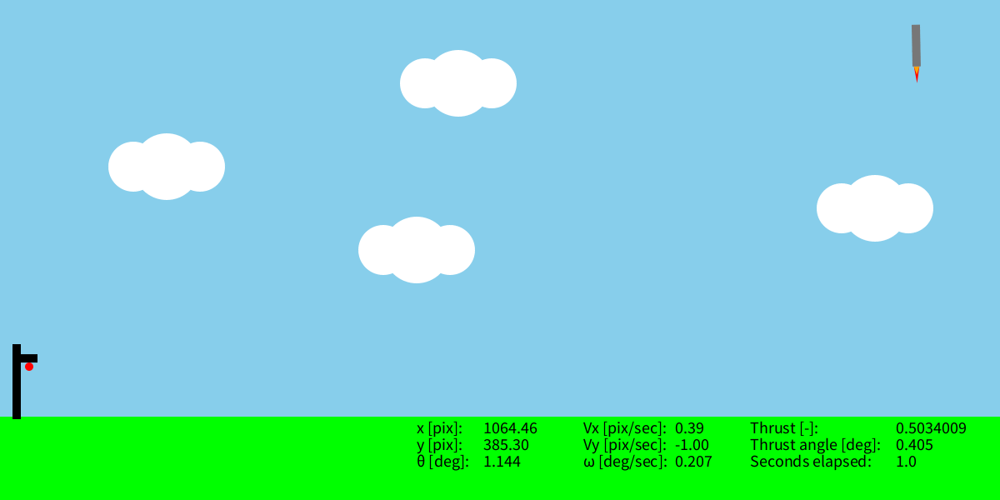

# StaRS 2D - an educational 2D Starship Re-entry Simulator



This is a very simple simulator to re-create the Starship's re-entry task.
You can design your own controller by measuring Starship's attitude and
determining its thrust vectoring control.
You should only modify the code in <em>stars2d.pde</em> by defining useful
variables at the beginning of the file and/or adding control inputs in the
"Controller design" area.

It is possible to retrieve data from the Starship on-board sensors using:
1.  <em>env.getStarshipXPosition()</em>: to get its position's x-coordinate;
1.  <em>env.getStarshipVx()</em>: to get its velocity's x-coordinate;
1.  <em>env.getStarshipYPosition()</em>: to get its position's y-coordinate;
1.  <em>env.getStarshipVy()</em>: to get its velocity's y-coordinate;
1.  <em>env.getStarshipAngle()</em>: to get its angle w.r.t. the y-axis;
1.  <em>env.getStarshipOmega()</em>: to get its angular velocity;
1.  <em>env.getElapsedTime()</em>: to get the elapsed time from the beginning of
the simulation.

The following figure should better explain the description of the Starship's
attitude variables.


You can also get the destination point's coordinates by using
<em>env.getDestinationX()</em> and <em>env.getDestinationY()</em>.
These simply returns 0 as the landing point is considered to be the zero point
of the coordinates system.

To provide control inputs, you can use:
1.  <em>cmd.setThrustCommand</em>: to determine the thrust;
1.  <em>cmd.setThrustAngleCommand</em>: to determine the angle of thrust
vectoring.

The thrust command is a value between 0 and 1.
If you provide a negative value, 0 will be considered; if you provide a number
greater than 1, 1 will be considered.
When the Starship's angle $\theta$ equals 0, a thrust command of 0.5 compensates
gravity.


The thrust angle is limited to the interval [-30,30] degrees.
Such a command must be given in radians.


The re-entry task is considered a failure if:
1.  You crash to the ground;
2.  You hit the tower;
3.  You land too quickly (velocity must be between -0.1 and 0.1 [pixel/seconds]
the moment you reach the destination point).

How you win:
1.  Landing on the destination tower. You must reach any point that has as
(x,y)-coordinate a value between [-1,1] pixels while having
$\theta$ in [-0.5,0.5] degrees.

## Dynamics implementation

The Starship's dynamics are implemented in a very simple way.
It is assumed that the center of mass and the center of gravity coincide.
Therefore, letting <em>T</em> be the thrust command, the forces equations are
implemented as:

```math
F_x=T\sin(\theta),\ F_y=T\cos(\theta)-g
```

Letting <em>L</em> be the length of the ("longer" side of the) Starship,
the torque equation is implemented as:

```math
\tau=T\frac{L}{2}\sin(\theta)
```

Hence, it is possible to determine the accelerations by multiplying the forces
by the inverse of the Starship's mass $m$ (that is equal to $1$) and the
torque by the inverse of the inertia $I$ (that is equal to $10$).
Then, simple integration of these equations produces the motion dynamics of the
Starship.

quick explanation of simplified version's equations
