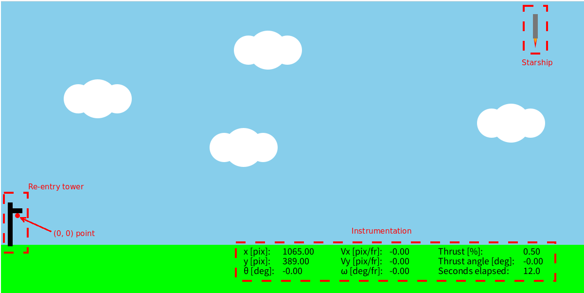
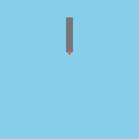
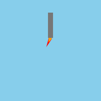
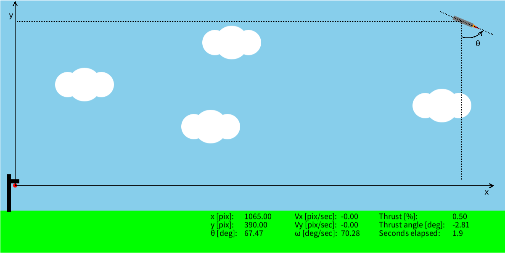

# Learn the basics of Control Engineering
## Lesson 1: Feedforward control

<p align="center">
<em>Welcome to the first lesson of "Learn the basics of Control
Engineering"!</em></p>

Control engineering is becoming more and more important nowadays: just to
give you an idea, the design of
modern aircrafts, spaceships and autonomous cars widely relies on it.

But... what is control engineering? Well, this course aims at giving you
insights to answer this question by considering a current fascinating control
engineering application: <em>the Starship re-entry task</em>.

In this course, you will:
-   Learn how to design simple controllers using both standard control
engineering techniques and modern AI-based ones;
-   Use an educational 2D Starship Re-entry Simulator (StaRS 2D) in
[Processing](https://processing.org/) to see your controller designs in action!

---

<em>Prerequisites:</em>
1.  Some experience with coding
2.  Understanding of basic physics, mathematics and trigonometry

---

<em>Outline of the lesson:</em>
1.  [Installation](#installation)
2.  [Main script](#main-script)
3.  [Thrust vectoring](#thrust-vectoring)
4.  [Instrumentation](#instrumentation)
5.  [Forces and torques simplification](#forces-and-torques-simplification)
6.  [Rules](#rules)
7.  [Feedforward control design](#feedforward-control-design)

## Installation

Install Processing (specify version).
Copy the repository and open project in Processing.

## Main script

The main Processing's script is "stars2d.pde".
This first time you open it, it looks like this:

```java
Environment env;
Command cmd;

void setup() {
    size(1200, 600);

    env = new Environment();
    cmd = new Command();
}

void draw() {
    env.initialize();

    // -------------------------------------------------------------------------
    // ------------------------- Controller design -----------------------------
    // -------------------------------------------------------------------------

    // -------------------------------------------------------------------------
    // -------------------------------------------------------------------------
    // -------------------------------------------------------------------------

    // Update
    env.updateStarship(cmd);
}
```

Explain how setup and draw work.

The script defines two variables "env" and "cmd" of type Environment and
Command, respectively.
These provide several useful methods to interact with the simulator.
The setup() function initializes these two variables and defines the size of
the graphics window.
In order to make the code working, do not modify these lines of code unless when
specified in these lessons.

The draw() function calls the env method "initialize()".
This method creates the graphics of the simulator that looks like this:



1.  Bottom right, there is instrumentation;
2.  Starship is highlighted at the top right;
3.  The "reentry" tower is at the bottom left;
4.  The red circle beside the reentry tower represents the "zero" coordinate and
the point to reach.

At the end of the draw() function, another Environment's method is called:
updateStarship(cmd). Through the cmd variable, it is possible to manipulate the
direction of the thrust (see [Thrust vectoring section](#thrust-vectoring)).

## Thrust vectoring

(mention the functions that do that)

1.  Thrust animation screenshots



1.  Thrust angle screenshots



## Instrumentation

Starship attitude: $(x,y,\theta)$



Explain all unit of measures

## Forces and torques simplification

Forces and torques are simplified to velocities and angular velocities so that
it is possible to design simpler controllers.

Gravity is therefore a constant velocity pushing downwards. Thrust at $0.5$ with
thrust angle equal to $0$ perfectly "defeats" gravity.

## Rules

How you lose:
1.  Crash (ground)
2.  Crash (tower)
3.  Too quick landing

How you win:
1.  Reach (0, 0) point with $\theta=0$ (position and attitude tolerances)

# Feedforward control design

What does feedforward mean?

Design
